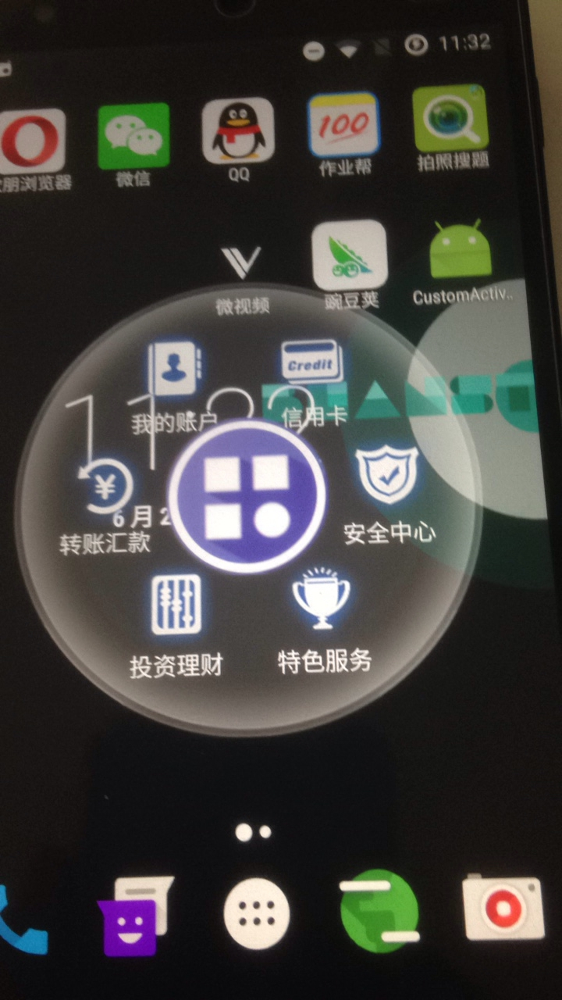
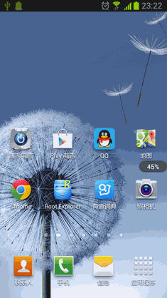

类似ios 悬浮菜单
Android桌面悬浮窗效果实现，仿360手机卫士悬浮窗效果

Android桌面悬浮窗进阶，QQ手机管家小火箭效果实现
本文来自：http://blog.csdn.net/daditao/article/details/28138105，以及

http://blog.csdn.net/guolin_blog/article/details/16919859

	/**
	 * 用于获取状态栏的高度。
	 *
	 * @return 返回状态栏高度的像素值。
	 */
	private int getStatusBarHeight() {
		if (statusBarHeight == 0) {
			try {
				Class<?> c = Class.forName("com.android.internal.R$dimen");
				Object o = c.newInstance();
				Field field = c.getField("status_bar_height");
				int x = (Integer) field.get(o);
				statusBarHeight = getResources().getDimensionPixelSize(x);
			} catch (Exception e) {
				e.printStackTrace();
			}
		}
		return statusBarHeight;
	}

效果图1

效果图2
